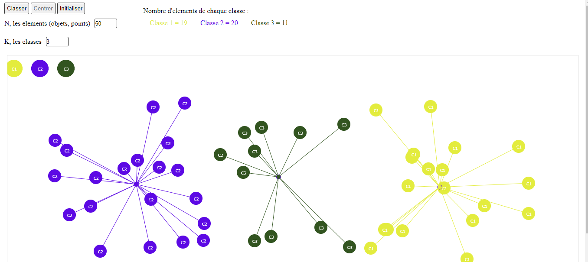

## K-means clustering 
k-means clustering is a method of vector quantization, originally from signal processing, that aims to partition n observations into k clusters in which each observation belongs to the cluster with the nearest mean (cluster centers or cluster centroid), serving as a prototype of the cluster. [wikipedia](https://en.wikipedia.org/wiki/K-means_clustering)

Back in 2016 during my master's degree, I had to explain this method to my colleagues in a presentation. So I made a quick visualization using javascript and [HTML canvas API](https://developer.mozilla.org/en-US/docs/Web/API) to help me go throw the algorithm step-by-step.



### Try it:

1. Clone the project, in the terminal run: 
```bash
$ git clone git@github.com:abachi/k-means.git
```
2. Open the ``index.html`` file with your browser.